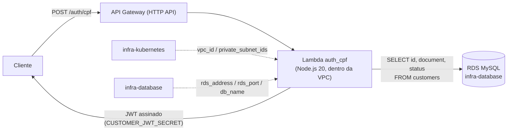

# lambda-auth-cpf

Function Serverless que autentica um cliente pelo CPF: recebe o CPF, valida o formato/dígitos verificadores, consulta a tabela `customers` (coluna `document`) no RDS e devolve um JWT.

## Arquitetura



Documentação da API: [`openapi.yaml`](./openapi.yaml) (único endpoint, `POST /auth/cpf`).

## Endpoint

```
POST /auth/cpf
Content-Type: application/json

{ "cpf": "111.444.777-35" }
```

Resposta (200):
```json
{
  "token": "...",
  "token_type": "Bearer",
  "expires_in": 3600,
  "customer": { "id": 42 }
}
```

`422` se o CPF for inválido (formato/dígitos), `404` se não existir cliente com aquele `document`, `403` se o cliente existir mas estiver com `status != active`.

## Decisão importante: guard separada

O JWT emitido aqui usa um segredo próprio (`CUSTOMER_JWT_SECRET`) e **não** é aceito pela guard `api`/jwt-auth que a API Laravel já usa hoje — aquela resolve `App\Models\User` (staff), e um cliente identificado por CPF não é um `User` cadastrado. Ver `docs/CustomerJwtMiddleware.php.example` para o middleware que precisa ser adicionado no repositório `tech-challenge-fiap` pra validar esse token separado. Isso é só uma sugestão de código — não faz parte do Terraform deste repositório.

## Suposições confirmadas

- A tabela `customers` tem `id`, `document` (string, 14 chars, formato `000.000.000-00`) e `status` (`enum('active','inactive')`, default `active` — adicionado via migration no repositório `tech-challenge-fiap`). `src/index.js` consulta as três e bloqueia com `403` quando o cliente não está `active`.
- `db_username`/`db_password` aqui precisam ser idênticos aos do repositório `infra-database` (mesmo usuário do RDS).

## O que este repositório cria

- Uma Lambda Node.js 20 dentro da VPC (mesmas subnets privadas do EKS), usando a `LabRole` do AWS Academy (`role = var.lab_role_arn`, sem criar IAM role nova).
- Um API Gateway HTTP API com a rota `POST /auth/cpf` apontando pra essa Lambda.
- Um security group próprio pra Lambda (só egress — ela não recebe conexão de rede diretamente, é invocada pelo serviço Lambda).
- A **rota autenticada da API principal**: `ANY /{proxy+}`, protegida por um Lambda authorizer, repassando pra app Laravel no EKS (ver seção abaixo).

## Rota autenticada da API principal (API Gateway → EKS)

Qualquer chamada que não seja `POST /auth/cpf` cai na rota curinga `ANY /{proxy+}`, que:

1. Passa primeiro pelo **Lambda authorizer** (`authorizer.tf`, função `customer-jwt-authorizer`) — ele lê o header `Authorization: Bearer <token>`, valida a assinatura HS256 com `CUSTOMER_JWT_SECRET` (mesmo segredo usado por `auth_cpf`) e confere `type === "customer"`. Sem token válido, a requisição nem chega no backend (`401`, resposta simples `isAuthorized: false`).
2. Se autorizada, o API Gateway repassa (`HTTP_PROXY`) pro NLB público do Service `postech-app`, criado pelo repositório `tech-challenge-fiap`.

Exemplo: `GET <api_endpoint>/api/customer/me` com `Authorization: Bearer <token da /auth/cpf>` chega em `GET /api/customer/me` na app Laravel, que valida o mesmo token de novo com o middleware `AuthenticateCustomerJwt` (dupla checagem — authorizer no Gateway, guard na aplicação).

**Decisão**: rota proxy pública em vez de VPC Link — mais simples e rápida de aplicar no AWS Academy (VPC Link exigiria trocar o Service Laravel pra `internal` e provisionar mais um recurso). Quem protege a rota é o authorizer, não a topologia de rede.

**Por que não o "JWT authorizer" nativo do API Gateway?** Ele só valida tokens RS256 via JWKS de um IdP (Cognito, Auth0 etc.). O token da Lambda `auth_cpf` é HS256 com segredo compartilhado, sem IdP — por isso a validação é feita numa Lambda authorizer própria.

**Passo manual necessário**: como este repositório é aplicado *antes* do `tech-challenge-fiap` (que só existe depois que `infra-kubernetes` e `infra-database` já rodaram), o NLB da app ainda não existe no primeiro apply daqui. `var.app_backend_domain` começa vazio. Depois que `tech-challenge-fiap` for aplicado, rode `make k8s-urls` lá, pegue o hostname do NLB (ex.: `xxxxx.elb.us-east-1.amazonaws.com`) e configure o secret `APP_BACKEND_DOMAIN` neste repositório (sem porta, sem `http://`) — o próximo push em `main` (ou um `workflow_dispatch`) já aplica a rota apontando pro backend certo.

## Testes

```bash
cd src
npm install   # (não --production, precisa do jest)
npm test
```

Cobre `cpf.js` (formato/dígito verificador) e `index.js` (400/422/404/403/200/500), mockando `mysql2/promise`.

## Build e deploy

O CI (`.github/workflows/deploy.yml`) roda `npm ci --production` dentro de `src/` e de `src-authorizer/` antes do `terraform apply` — cada `data.archive_file` empacota seu diretório (já com `node_modules`) num zip que vira o código de cada Lambda. `pull_request` só faz `terraform plan`; `push` em `main` e `workflow_dispatch` aplicam de verdade (`terraform apply -auto-approve`) — automático a partir de agora, desde que os secrets do Academy (`AWS_ACCESS_KEY_ID`/`AWS_SECRET_ACCESS_KEY`/`AWS_SESSION_TOKEN`) estejam atualizados na organização do GitHub.

Para rodar local:

```bash
cd src && npm ci --production && cd ..
cd src-authorizer && npm ci --production && cd ..

terraform init \
  -backend-config="bucket=SEU_BUCKET" \
  -backend-config="key=lambda-auth-cpf/terraform.tfstate" \
  -backend-config="region=us-east-1" \
  -backend-config="dynamodb_table=SUA_TABELA_LOCK"

terraform plan
terraform apply
```

## terraform.tfvars

```hcl
aws_region      = "us-east-1"
tf_state_bucket = "SEU-NOME-UNICO-DE-BUCKET"
lab_role_arn    = "arn:aws:iam::123456789012:role/LabRole"

db_password         = "..."   # igual ao infra-database
customer_jwt_secret = "..."   # gerar um valor novo, ex.: openssl rand -base64 48

# Preencher só depois do primeiro apply do tech-challenge-fiap (ver seção
# "Rota autenticada da API principal" acima):
app_backend_domain = ""
```
