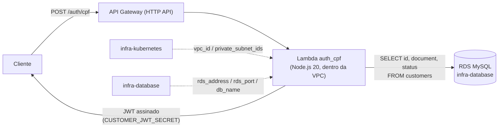

# lambda-auth-cpf

Function Serverless que autentica um cliente pelo CPF: recebe o CPF, valida o formato/dígitos verificadores, consulta a tabela `customers` (coluna `document`) no RDS e devolve um JWT.

## Arquitetura



Documentação da API: [`openapi.yaml`](./openapi.yaml) (único endpoint, `POST /auth/cpf`).

## Endpoint

```
POST /auth/cpf
Content-Type: application/json

{ "cpf": "111.444.777-35" }
```

Resposta (200):
```json
{
  "token": "...",
  "token_type": "Bearer",
  "expires_in": 3600,
  "customer": { "id": 42 }
}
```

`422` se o CPF for inválido (formato/dígitos), `404` se não existir cliente com aquele `document`, `403` se o cliente existir mas estiver com `status != active`.

## Decisão importante: guard separada

O JWT emitido aqui usa um segredo próprio (`CUSTOMER_JWT_SECRET`) e **não** é aceito pela guard `api`/jwt-auth que a API Laravel já usa hoje — aquela resolve `App\Models\User` (staff), e um cliente identificado por CPF não é um `User` cadastrado. Ver `docs/CustomerJwtMiddleware.php.example` para o middleware que precisa ser adicionado no repositório `tech-challenge-fiap` pra validar esse token separado. Isso é só uma sugestão de código — não faz parte do Terraform deste repositório.

## Suposições confirmadas

- A tabela `customers` tem `id`, `document` (string, 14 chars, formato `000.000.000-00`) e `status` (`enum('active','inactive')`, default `active` — adicionado via migration no repositório `tech-challenge-fiap`). `src/index.js` consulta as três e bloqueia com `403` quando o cliente não está `active`.
- `db_username`/`db_password` aqui precisam ser idênticos aos do repositório `infra-database` (mesmo usuário do RDS).

## O que este repositório cria

- Uma Lambda Node.js 20 dentro da VPC (mesmas subnets privadas do EKS), usando a `LabRole` do AWS Academy (`role = var.lab_role_arn`, sem criar IAM role nova).
- Um API Gateway HTTP API com a rota `POST /auth/cpf` apontando pra essa Lambda.
- Um security group próprio pra Lambda (só egress — ela não recebe conexão de rede diretamente, é invocada pelo serviço Lambda).

## O que ainda falta (próximo passo)

As **rotas autenticadas** da API principal (`rotas autenticadas` no diagrama — Cliente → API Gateway → EKS) ainda não têm uma integração aqui. Falta decidir entre:
- **VPC Link** do API Gateway apontando pro NLB interno do Service Laravel (mantém tráfego privado dentro da VPC); ou
- uma rota curinga simples (`ANY /{proxy+}`) apontando pro LoadBalancer público que o `app.tf` já cria.

Isso muda se o Service `postech-app` deveria continuar `LoadBalancer` público ou virar `internal` — ver a nota equivalente no `README-MIGRACAO.md` do repositório da aplicação.

## Testes

```bash
cd src
npm install   # (não --production, precisa do jest)
npm test
```

Cobre `cpf.js` (formato/dígito verificador) e `index.js` (400/422/404/403/200/500), mockando `mysql2/promise`.

## Build e deploy

O CI (`.github/workflows/deploy.yml`) roda `npm ci --production` dentro de `src/` antes do `terraform apply` — o `data.archive_file` empacota `src/` (já com `node_modules`) num zip que vira o código da Lambda. Para rodar local:

```bash
cd src && npm ci --production && cd ..

terraform init \
  -backend-config="bucket=SEU_BUCKET" \
  -backend-config="key=lambda-auth-cpf/terraform.tfstate" \
  -backend-config="region=us-east-1" \
  -backend-config="dynamodb_table=SUA_TABELA_LOCK"

terraform plan
terraform apply
```

## terraform.tfvars

```hcl
aws_region      = "us-east-1"
tf_state_bucket = "SEU-NOME-UNICO-DE-BUCKET"
lab_role_arn    = "arn:aws:iam::123456789012:role/LabRole"

db_password         = "..."   # igual ao infra-database
customer_jwt_secret = "..."   # gerar um valor novo, ex.: openssl rand -base64 48
```
